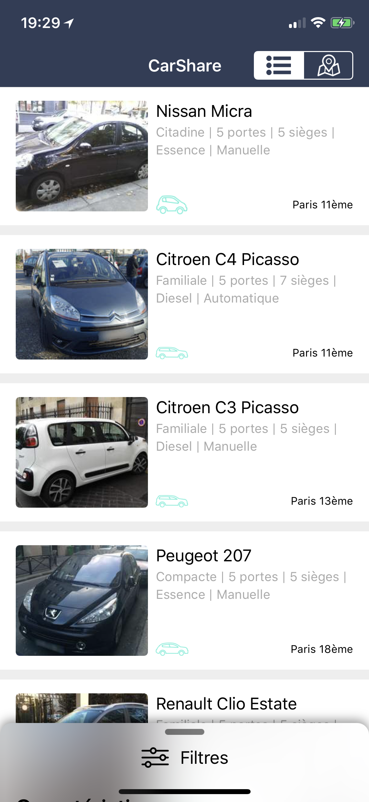
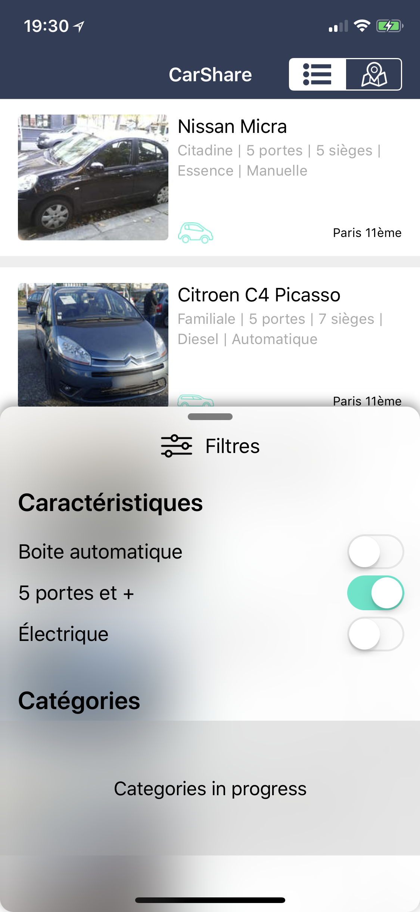
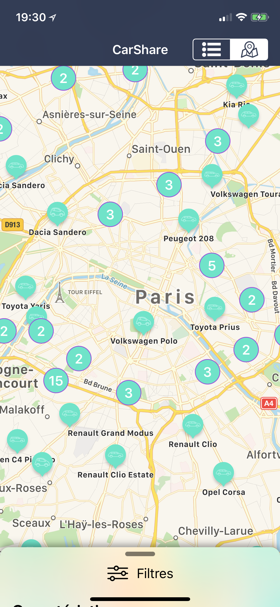
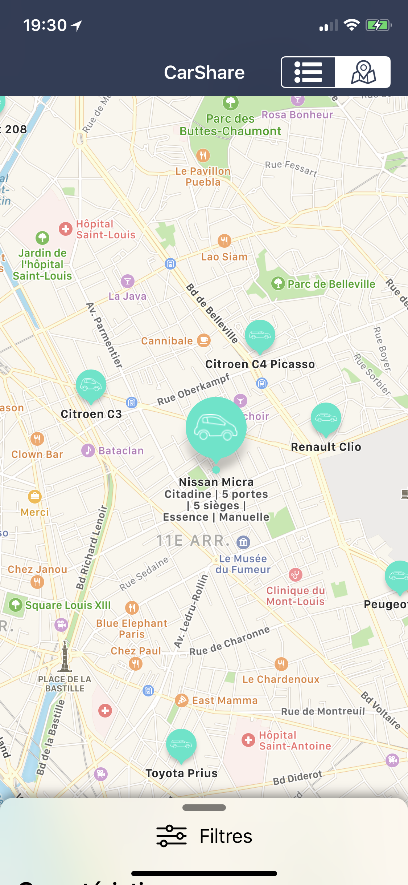

# CarShare
Test technique pour Koolicar

## Temps passé sur le projet
Environ 8h sur 72h

### Choses que j'aurais aimé faire mais pas le temps:
1. Faire une collection des filtres de catégories de voiture
2. Limiter le nombre de résultat si trop élevé (aucune vérification actuellement)
3. Faire les autres filtres dans une liste sous forme de tableView
4. Afficher le détail d'une voiture sur la carte quand pin sélectionné
5. Zoomer sur le cluster après sélection
6. Afficher quand des filtres sont sélectionnés et le nombre de résultats
7. Bien d'autres

### Aperçu:
   
   
   
   
